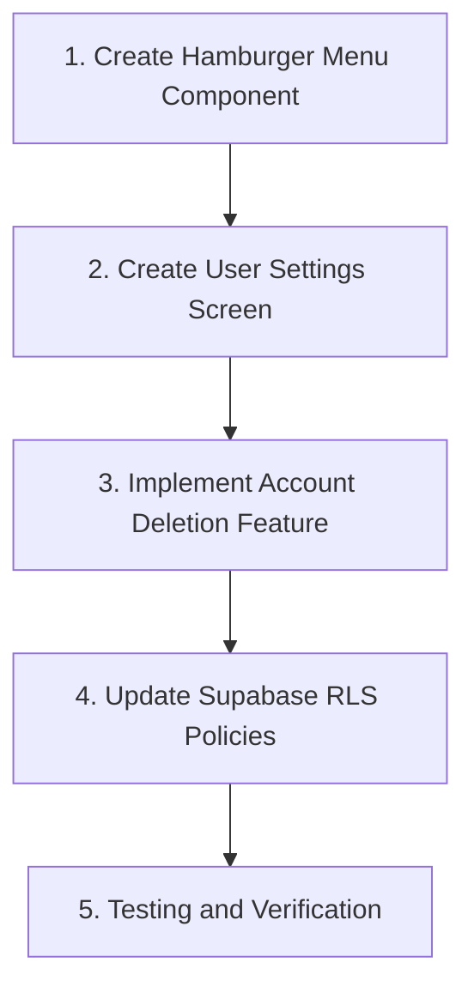
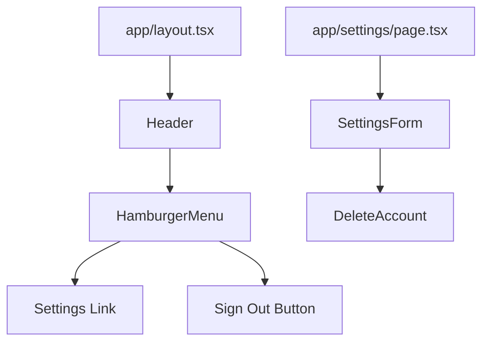

# Implementation Plan: User Settings Screen

## Current Analysis

The Private Diary app currently has:
1. A header with only the "Private Diary" title and authentication button (sign in/out)
2. No user settings screen or account deletion functionality
3. Authentication supported only through GitHub OAuth
4. Built with Next.js, TypeScript, TailwindCSS, and Supabase

## Implementation Plan

We'll implement the hamburger menu and user settings screen with the following steps:



## File Structure and Changes

### New Files:

1. **Header Component**
   - `components/Header/index.ts`
   - `components/Header/Header.tsx`

2. **Hamburger Menu Component**
   - `components/Header/HamburgerMenu/index.ts`
   - `components/Header/HamburgerMenu/HamburgerMenu.tsx`

3. **Settings Page**
   - `app/settings/page.tsx`

4. **Settings Components**
   - `components/Settings/index.ts`
   - `components/Settings/SettingsForm.tsx`
   - `components/Settings/DeleteAccount.tsx`

### Files to Modify:

1. **Layout**
   - `app/layout.tsx` - Integrate the Header component

2. **Auth Button**
   - `app/auth-button-client.tsx` - Adjust as needed

## Technical Details

### 1. Hamburger Menu Component
- Create a Header component that includes the app title and hamburger menu
- Use Lucide React's `Menu` icon for the hamburger button
- Implement a dropdown menu with "Settings" and "Sign Out" options
- Integrate the existing AuthButtonClient component

### 2. User Settings Screen
- Create a settings page following Next.js App Router conventions
- Implement layout and UI components for the settings screen
- Display user profile information
- Create an account deletion section
- Verify authentication state and redirect unauthenticated users

### 3. Account Deletion Feature
- Create a DeleteAccount component with confirmation dialog
- Display warnings about the risks of account deletion
- Implement Supabase client API for account deletion:
  ```typescript
  // Delete user posts
  await supabase.from('posts').delete().eq('user_id', user.id)

  // Delete user profile
  await supabase.from('users').delete().eq('id', user.id)

  // Delete authentication data
  await supabase.auth.admin.deleteUser(user.id)
  ```
- Implement redirect after deletion

### 4. Supabase RLS Policies
- Update RLS policies to allow users to delete their own data
- Create necessary migration files

### 5. Testing and Verification
- Verify hamburger menu display and functionality
- Test navigation to settings screen
- Test account deletion feature
- Verify mobile display

## Component Structure



## UI/UX Considerations

1. **Hamburger Menu**:
   - Consistent display on both mobile and desktop
   - Accessibility considerations (keyboard navigation, screen reader support)
   - Apply animation effects

2. **Settings Screen**:
   - Simple and intuitive layout
   - Appropriate warnings for dangerous operations (account deletion)
   - Feedback display for operation results

3. **Account Deletion Flow**:
   - Two-step confirmation process
   - Clear explanation of deletion impacts
   - Provide cancellation option

## Security Considerations

1. Proper verification of authentication state
2. Implementation of CSRF protection
3. Appropriate authentication verification for account deletion operations

This implementation will provide users with the ability to manage and delete their accounts through an intuitive hamburger menu and settings screen.
