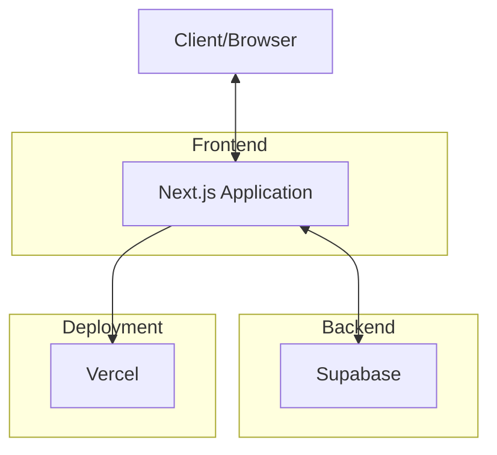
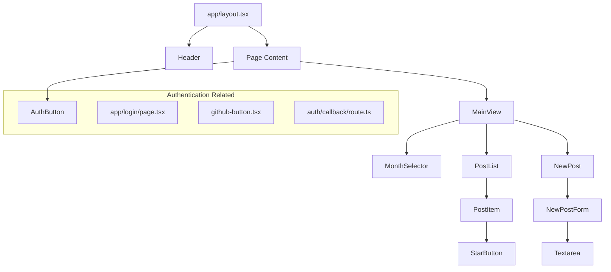

# System Patterns: Private Diary

## System Architecture
Private Diary adopts a Jamstack architecture, using Next.js as the frontend framework and Supabase as the backend service.

## Key Technical Decisions
1. **Next.js**: Provides server-side rendering (SSR) and static site generation (SSG) capabilities, optimizing SEO and performance.
2. **TypeScript**: Ensures type safety and enhances error detection during development.
3. **Supabase**: Offers a comprehensive backend solution including PostgreSQL database, authentication, and storage.
4. **TailwindCSS**: A utility-first CSS framework that enables rapid implementation of custom designs.
5. **Vercel**: Provides seamless deployment and high-performance hosting for Next.js applications.

## Design Patterns
1. **Component-Based Architecture**
   - UI is divided into reusable, independent components.
   - Each component has specific responsibilities and can be combined as needed.

2. **Page-Based Routing**
   - Leverages Next.js's file-system-based routing.
   - The file structure within the `app/` directory defines the application's route structure.

3. **Authentication Pattern**
   - Implements secure user authentication using Supabase's authentication system.
   - Supports multiple authentication methods including GitHub OAuth.

4. **Data Fetching Pattern**
   - Appropriately separates server components and client components.
   - Optimizes performance and security by performing data fetching server-side and UI rendering client-side.

## Component Relationships

## Directory Structure Pattern
Private Diary adopts a clear directory structure based on functionality and components:

1. **`app/`**: Pages and route definitions based on Next.js App Router
   - `page.tsx`: Main component for each route
   - `layout.tsx`: Layout definitions
   - `auth/`: Authentication-related routes and handlers

2. **`components/`**: Reusable UI components
   - Grouped by functionality (e.g., `MainView/`, `Header/`)
   - Each component has its own directory with related files grouped together
   - Uses `index.ts` files to provide clean import paths

3. **`lib/`**: Utility functions, type definitions, helpers
   - `database.types.ts`: Supabase database type definitions
   - `utils/`: Common utility functions such as date manipulation

4. **`public/`**: Static assets (images, icons, etc.)

5. **`supabase/`**: Supabase-related configuration and migrations
   - `migrations/`: Database schema change history
   - `config.toml`: Supabase configuration

## Data Flow
1. Users access the application through authentication.
2. Authenticated users can create, view, and update their diary entries.
3. Diary data is stored in the Supabase database and encrypted/decrypted client-side.
4. The monthly selector can be used to filter diary entries for a specific month.
5. Users can mark specific entries as favorites.

## Security Patterns
1. **Authentication**: Uses Supabase's secure authentication system
2. **Client-Side Encryption**: Diary content is encrypted client-side
3. **RLS (Row Level Security)**: Database-level access control in Supabase
4. **Environment Variables**: Sensitive information is securely managed as environment variables

## Extensibility and Maintainability
- Component-based design makes it easy to add new features
- TypeScript's type safety ensures safe refactoring and code changes
- Clear directory structure improves code discoverability and maintainability
- Supabase migrations manage database schema changes
